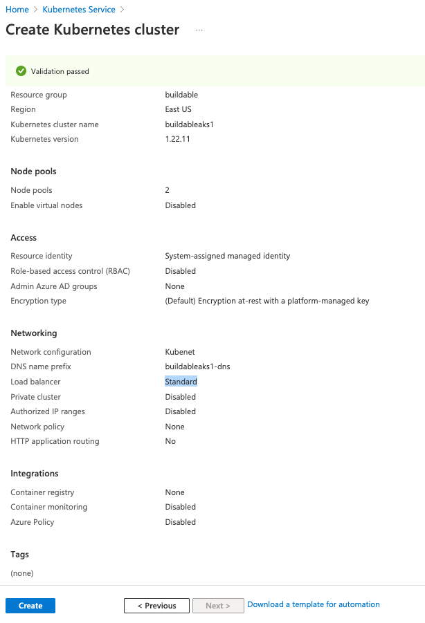
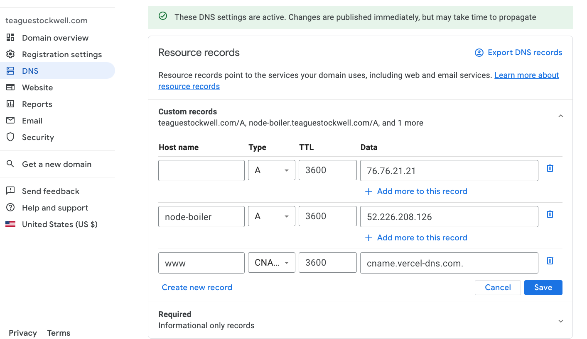

# setup env for CD

1. create a container registry in azure
1. create an aks cluster with this config 
1. create a github action secret named `REGISTRY_LOGIN_SERVER` with the value of the registry login server
1. create a github action secret named `REGISTRY_USERNAME` with the value of the registry username
1. create a github action secret named `REGISTRY_PASSWORD` with the value of the registry password
1. create a github action secret named `JWT` with the value of the secret used to verify req.headers.authorization
1. create github action secret named `KUBE_CONFIG` with the yml from `az aks get-credentials --resource-group k8s-demo-ss --name k8s-demo-cluster-ss --file secret.kubeconfig`

# get https cert status

- kubectl describe certificate node-boilerplate

# https Ingress (wip)

- `helm repo add cert-manager https://charts.jetstack.io`
- `helm install my-cert-manager cert-manager/cert-manager`
- `helm repo add ingress-nginx https://kubernetes.github.io/ingress-nginx`
- `helm install nginx-ingress ingress-nginx/ingress-nginx`
- apply cert manger deps to the cluster `kubectl apply -f k8/issuer.yml && kubectl apply -f k8/certificate.yml && kubectl apply -f k8/ingress.yml`
- create an a record for the ip address of the ingress controller 
- grep `node-boiler.teaguestockwell.com` and replace it with the the host you assigned to the a record
- bump the pipeline / manually redeploy as needed