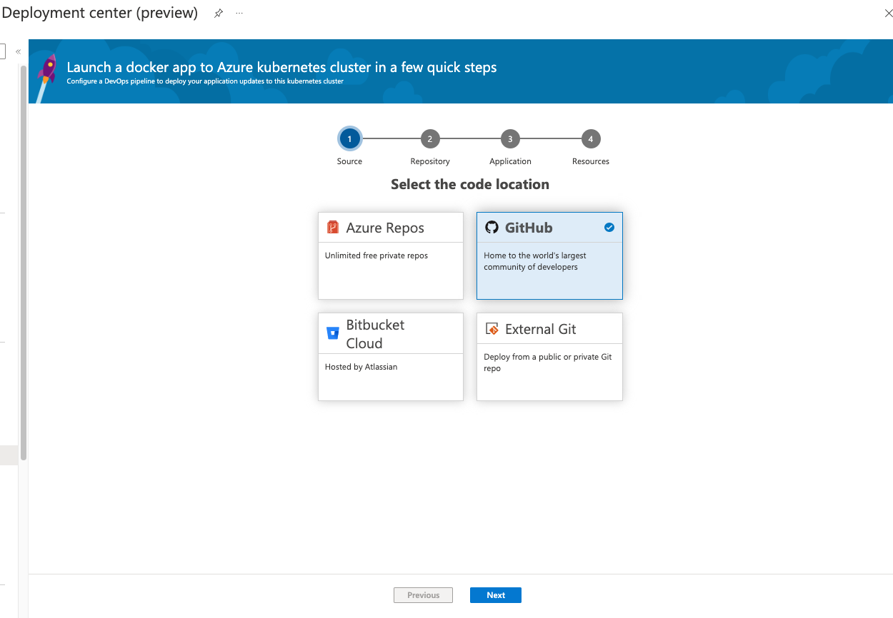
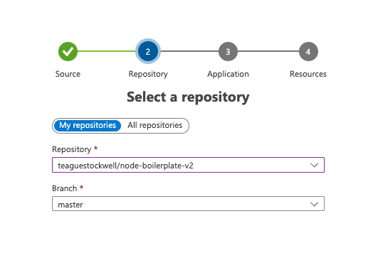
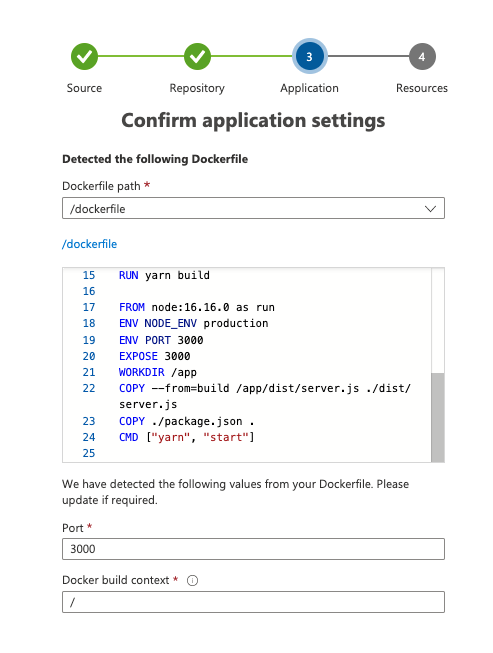
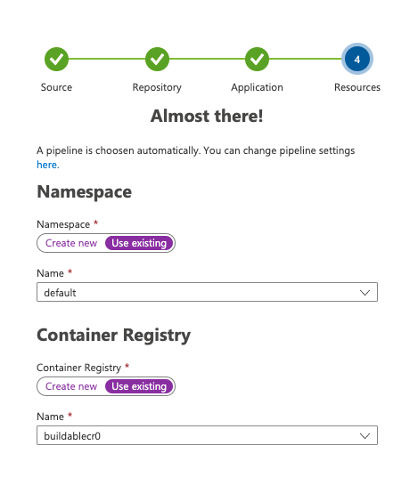

1. create a new container registry in azure
1. create aks cluster 
1. configure actions secrets deploy to the cluster


you may edit this to use dockerfile.ci later

select the default namespace, and the container registry you created

1. git pull origin

# creating a secret
1. az login
1. open azure portal, select aks cluster, click connect and run commands
1. echo -n '[secretValueHere]' > [secretKey].txt
1. kubectl create secret generic [secretName] --from-file=[secretKey].txt --namespace=buildablekc0b119
1. kubectl get secret mysecrets --namespace=buildablekc0b119 -o jsonpath='{.data}'
1. add the secret to deployment.yml
```sh
 - name: "scraper"
          image: "buildablecr0.azurecr.io/node-boilerplate"
          ports:
          - containerPort: 3000
          env:
          - name: secret
            valueFrom:
              secretKeyRef:
                name: mysecrets
                key: secret.txt
```
# Get https cert status
- kubectl describe certificate node-boilderplate

# HTTPS Ingress (wip)
- apply cert-manager to the cluster `kubectl apply -f https://github.com/cert-manager/cert-manager/releases/download/v1.9.1/cert-manager.crds.yaml`
- apply nginx-ingress chart to k8s cluster `helm install ingress-nginx ingress-nginx/ingress-nginx` 
- create a new a record in the dns for the public ip of the nginx ingress
- add the host name of that record to `k8/ingress.yml` and `k8/certificate.yml`
- bump the pipeline / manually redeploy as needed
